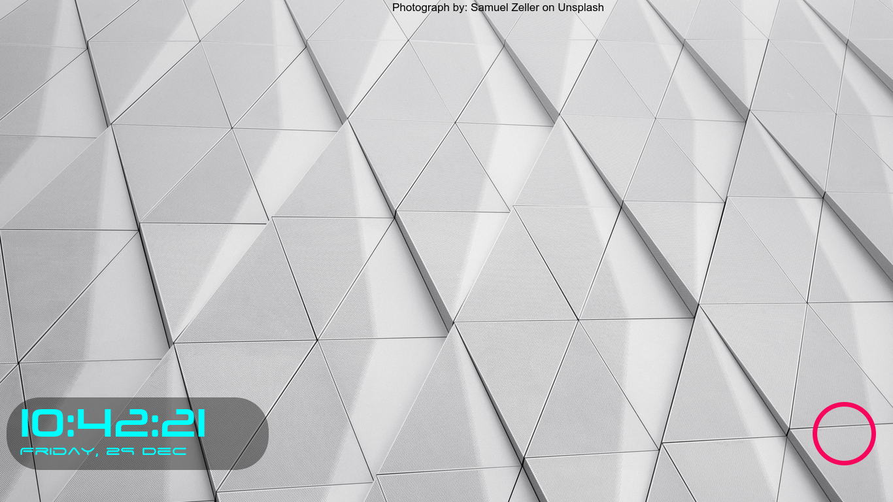
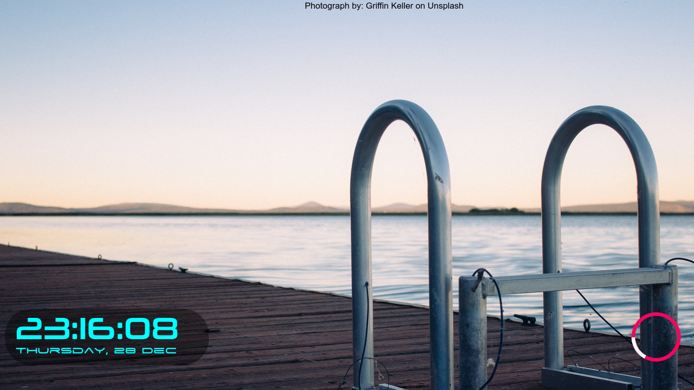

# i3lock Delta

This prorgam downloads a new image from [Unsplash][1]. It checks whether the screen was locked every 5 minutes. In case of no Internet, it retries every 1 minute and displays the previous picture untill a new one is downloaded. The script allows to filter random images based on your choices.

## Dependencies

+ [PHP][2] - Available in repositories of most popular distributions.
+ [Composer][3] - Available in repositories of most popular distributions.
+ [Imagemagick][4] - Specifically, the `convert` command.
+ [i3lock-color][5] - Available in AUR (For Arch users). Fork of i3lock with more features. Do not use i3lock since this program utilizes the features of i3lock-color.
+ [bash][6] - Most probably will be installed already.

## Screenshots





## Installation

Run the following commands
```bash
cd
git clone https://github.com/Ceda-EI/i3lock-delta
cd i3lock-delta
./install
```

Save your Unsplash `applicationId` in `~/i3lock-delta/api_key`. You can get the `applicationId` from registering at [Unsplash Developer.][7]

## Usage

+ Check that the `applicationId` in ``~/i3lock-delta/api_key`` is correct.
+ Add `~/i3lock-delta/download_daemon &` to your startup applications. Also, run `~/i3lock-delta/download_daemon &` to avoid rebooting.
+ To lock the screen, run `~/i3lock-delta/lock`. You can map this to your lock key combination.

## Configuration

The lock screen customization has been made easier using `~/.config/lock_preferences`,`api_key`, `config` and `box_config` files.

+ If the random background should be selected from certain topics, enter the topics in `~/.config/lock_preferences` with one topic per line i.e. each line should contain only one topic.
+ To insert your own Unsplash API Key, type/paste it in the `~/i3lock-delta/api_key` file.
+ To change the ring color/size or date/time color/style/size/font uncomment (remove the # at start) the corresponding line in `~/i3lock-delta/config` and set the value after the `=` sign.
+ To change the position of box drawn for the clock or the position of the text for photographer, edit `~/i3lock-delta/box_config`.

## Fonts Used
+ Font used for date: [Space Age][8]
+ Font used for time: [Neuropolitical][9]

<!--Links-->
[1]: https://unsplash.com
[2]: https://php.net
[3]: https://getcomposer.org
[4]: https://imagemagick.org
[5]: https://github.com/PandorasFox/i3lock-color
[6]: https://www.gnu.org/software/bash/
[7]: https://unsplash.com/developers
[8]: https://dl.dafont.com/dl/?f=space_age
[9]: https://dl.dafont.com/dl/?f=neuropolitical
